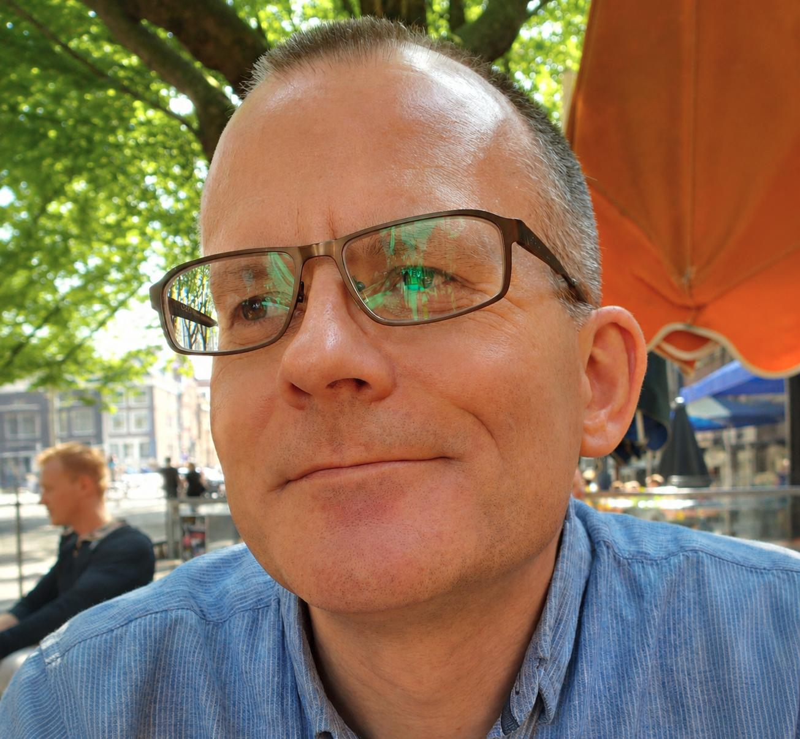

Over the years I have contributed to a wide range of television and radio programmes, from various documentaries about early Christianity to BBC Radio 4's _In Our Time_. More recently, I've appeared on a number of niche podcasts, talking about everything from religious terrorism and North African slavery to the end of the world — and why Bedford is the place to be when that happens. 

I have also provided specialist advice for television dramas, and from time to time my research and public talks have been featured in newspapers. I regularly support journalists working on religious themes for major UK media, including _The Economist_, the _BBC_, the _New Scientist_, _The Times_, and the _Guardian._ I've also occasionally written for magazines such as the _Fortean Times_. 

I am always happy to answer questions about the fields within which I work, or to discuss the study of religion more generally. I care a great deal about the public understanding of religion and the need to foster a critical and informed approach to its various forms today. If you think I can be of any help, please don't hesitate to get in touch.

⮕ **For media queries, please contact me at**: [jjm1000@cam.ac.uk](mailto:jjm1000@cam.ac.uk).

