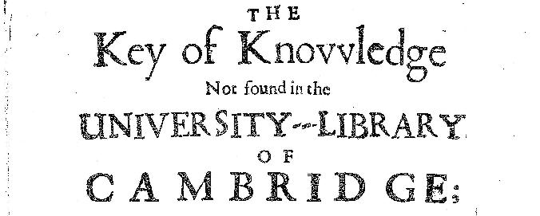

(A sobering reminder of the limits of scholarship from the title page of an early modern book now found in the University Library of Cambridge.)

This page includes all my publications without distinguishing between the different subject areas within which I work. 

 

### **Books**

*Studies in the Historical Jesus: Anarchy, Miracles, and Madness.* Critical Studies in Religion and History 1 (Cambridge: Mutual Academic, 2023). Pdf available here: https://doi.org/10.17613/mpjp-3c10

*Early Quakers and Islam: Slavery, Apocalyptic and Christian-Muslim Encounters in the Seventeenth Century.* Studies on Inter-Religious Relations 59 (Uppsala: Swedish Science Press, 2013). New 2016 edition by Wipf and Stock available [here.](https://www.amazon.co.uk/Early-Quakers-Islam-Apocalyptic-Christian-Muslim/dp/1498291945/ref=sr_1_1?ie=UTF8&qid=1462529724&sr=8-1&keywords=Justin+quaker+islam)

*Paul, Poverty and Survival* (Edinburgh: T&T Clark, 1998).

*All Slave-Keepers that Keep the Innocent in Bondage, Apostates: An Early Abolitionist Attack on Slavery* (critical edition with Marcus Rediker). In preparation.

*Rethinking the Germantown Protest: Mediterranean Slavery and the Origins of Atlantic Abolitionism*. In preparation.

### **Articles, Chapters etc.**

‘“Babilon's Bastards” [sic] and the End of Hell: Alterity, Abolitionism, and Benjamin Lay's Use of the Book of Revelation.’ *Forthcoming.*

‘Thinking with Other Things: Resurrection, Doubt, and Comparative Microhistory.’ *Religion and Theology* 33.1-2 (2026), 67-101. Open access copy here: DOI: https://doi.org/10.1163/15743012-bja10114

‘Teaching the Historical Jesus in Continuing Education: Of Ghosts and Groundhogs.’ *Journal for the Study of the Historical Jesus* 23.1 (2025), 89-105. Open access copy here: DOI: https://doi.org/10.1163/17455197-bja10045

‘Foreword.’ In *Minute Book of the Monthly and Quarterly Meetings of Ratcliff Quakers, 1681-1701.* Ed. Judith Roads (Cambridge: Mutual Academic 2025), pp. i-iv.

‘The Resurrection and Comparative Microhistory.’ In *The Next Quest for the Historical Jesus*. Ed. James Crossley and Chris Keith (Grand Rapids, MI: William B. Eerdmans, 2024), pp. 507–27.

‘Mary Fisher’ In *Christian-Muslim Relations: Primary Sources 1500-1700*. Ed. Martha Theodora Frederiks (London: Bloomsbury Publishing, 2023), pp. 269-272.

‘Putting the Apocalyptic Jesus to the Sword: Why were Jesus’ Disciples Armed?’ *Journal for the Study of the New Testament* 45.4 (2023), 371–404.

*'*Losing Books in a "Scriptural Universe"': What Happened to Papias?’ In *The Scriptural Universe of Late Antiquity.* Ed. Emmanouela Grypeou (Salamanca: Universidad Pontificia de Salamanca, 2021), pp. 23-54.

‘The Study of Terrorism and the Problem of “Apocalyptic.”’ *Contemporary Voices: St Andrews Journal of International Relations: Terrorism: Its Past, Present & Future Study A Special Issue to Commemorate CSTPV at 25* (2020), pp. 73-80. Pdf available [here.](https://www.justinmeggitt.info/s/The-study-of-terrorism-and-the-problem-of-Justin-J-Meggitt.pdf)

 ‘Does Religion Cause terrorism? The Problem of Religion and the Need for a Better Question.’ *Contemporary Voices: St Andrews Journal of International Relations: Terrorism: Its Past, Present & Future Study A Special Issue to Commemorate CSTPV at 25* (2020), pp. 66-72. Pdf available [here](https://www.justinmeggitt.info/s/In-Response-Does-religion-cause-terroris-Justin-J-Meggitt.pdf)

‘The Problem of Apocalyptic Terrorism.’ *Journal of Religion and Violence* 8.1 (2020), 58-104.

‘”More Ingenious than Learned”? Examining the Quest for the Non-historical Jesus.’ *New Testament Studies* 65.4 (2019), 443-460.

‘A Turke turn'd Quaker: Conversion from Islam to Radical Dissent in Early Modern England.’ *The Seventeenth Century* 34.3 (2019), 353-380.

‘Noël Aubert de Versé'. In *Christian-Muslim Relations. A Bibliographical History. Volume 13. Western Europe (1700-1800)*. Ed. David Thomas and John A. Chesworth (Leiden: Brill, 2019), pp. 75-76.

‘Epistle Dedicatory'. In *Christian-Muslim Relations. A Bibliographical History. Volume 13. Western Europe (1700-1800)*. Ed. David Thomas and John A. Chesworth (Leiden: Brill, 2019), pp. 77-85.

‘Early Unitarians and Islam: revisiting a "primary document.”’ In *Unitarian Theology II.* Ed. David Steers (London: Faith and Freedom, 2018), pp. 48-59. Pdf available [here](https://www.justinmeggitt.info/s/Early-Unitarians-and-Islam-Justin-Meggitt.pdf),

‘Was the Historical Jesus an Anarchist? Anachronism, Anarchism and the Historical Jesus.’ In *Essays on Anarchism and Religion.* Ed. Alexandre Christoyannopoulos and Matthew Adams. (Stockholm: Stockholm University Press, 2017), pp. 124-197. The chapter and book can be read [here](http://www.stockholmuniversitypress.se/site/books/10.16993/bak/)

[A German translation can be found [here:](https://www.edition-espero.de/archiv/espero_NF_004_2022-01.pdf) Justin J. Meggitt, ‘War Jesus ein Anarchist? Anachronismus, Anarchismus und der historische Jesus’, espero: Libertäre Zeitschrift 4 (2022): 11–85.]

'‘A Visitation of Love and Gentle Greeting of the Turk.' In *Christian-Muslim Relations. A Bibliographical History. Volume 8. Northern and Eastern Europe (1600-1700)*. Ed. David Thomas and John A. Chesworth (Leiden: Brill, 2016), pp. 377-383.

'An Apology for the True Christian Divinity.' In *Christian-Muslim Relations. A Bibliographical History. Volume 8. Northern and Eastern Europe (1600-1700)*. Ed. David Thomas and John A. Chesworth (Leiden: Brill, 2016), pp. 486-495.

'An additional account of George's Robinson's: shewing his call to go to Jerusalem; a short relation from George Robinson.' In *Christian-Muslim Relations. A Bibliographical History. Volume 8. Northern and Eastern Europe (1600-1700)*. Ed. David Thomas and John A. Chesworth (Leiden: Brill, 2016), pp. 395-402.

'Barclay, Robert.’ In *Christian-Muslim Relations. A Bibliographical History. Volume 8. Northern and Eastern Europe (1600-1700)*. Ed. David Thomas and John A. Chesworth (Leiden: Brill, 2016), pp. 483-486.

'Blessed openings of a day of good things to the Turks'. In *Christian-Muslim Relations. A Bibliographical History. Volume 8. Northern and Eastern Europe (1600-1700)*. Ed. David Thomas and John A. Chesworth (Leiden: Brill, 2016), pp. 383-387.

'Fisher, Mary.' In *Christian-Muslim Relations. A Bibliographical History. Volume 8. Northern and Eastern Europe (1600-1700)*. Ed. David Thomas and John A. Chesworth (Leiden: Brill, 2016), pp. 367-370.

'Fox, George.' In *Christian-Muslim Relations. A Bibliographical History. Volume 8. Northern and Eastern Europe (1600-1700)*. Ed. David Thomas and John A. Chesworth (Leiden: Brill, 2016), pp. 523-527.

'Islam and Christianity in the Works of George Fox.' In *Christian-Muslim Relations. A Bibliographical History. Volume 8. Northern and Eastern Europe (1600-1700)*. Ed. David Thomas and John A. Chesworth (Leiden: Brill, 2016), pp. 527-534.

'Letter Describing the Audience with Sultan Mehmed IV.' In *Christian-Muslim Relations. A Bibliographical History. Volume 8. Northern and Eastern Europe (1600-1700)*. Ed. David Thomas and John A. Chesworth (Leiden: Brill, 2016), pp. 370-374.

'Perrot, John.' In *Christian-Muslim Relations. A Bibliographical History. Volume 8. Northern and Eastern Europe (1600-1700)*. Ed. David Thomas and John A. Chesworth (Leiden: Brill, 2016), pp. 375-377.

'Robinson, George.' In *Christian-Muslim Relations. A Bibliographical History. Volume 8. Northern and Eastern Europe (1600-1700)*. Ed. David Thomas and John A. Chesworth (Leiden: Brill, 2016), pp. 392-395.

'Smith, Stephen.' In *Christian-Muslim Relations. A Bibliographical History. Volume 8. Northern and Eastern Europe (1600-1700)*. Ed. David Thomas and John A. Chesworth (Leiden: Brill, 2016), pp. 480-481.

'Strange and Wonderful news from Italy.' In *Christian-Muslim Relations. A Bibliographical History. Volume 8. Northern and Eastern Europe (1600-1700)*. Ed. David Thomas and John A. Chesworth (Leiden: Brill, 2016), pp. 427-430.

'Wholsome [sic] Advice.' In *Christian-Muslim Relations. A Bibliographical History. Volume 8. Northern and Eastern Europe (1600-1700)*. Ed. David Thomas and John A. Chesworth (Leiden: Brill, 2016), pp. 481-483.

'Wilson, Elias.' In *Christian-Muslim Relations. A Bibliographical History. Volume 8. Northern and Eastern Europe (1600-1700)*. Ed. David Thomas and John A. Chesworth (Leiden: Brill, 2016), pp. 426-427.

'Classical Antiquity, Possession and Exorcism’. In *Spirit Possession around the World: Possession, Communion, and Demon Expulsion across Cultures.* Ed. Joseph Laycock. Oxford: ABC Clio, 2014, pp. 17-19. (A rough draft with the supporting references can be found [here](https://www.justinmeggitt.info/s/Classical-antiquity-possession-and-exorcism-in-Meggitt.pdf)).

‘Did Magic Matter? The Saliency of Magic in the Early Roman Empire.’ *Journal of Ancient History* 1.2 (2013), 170-229.

‘The Historical Jesus and Healing: Jesus’ Miracles in Psychosocial Context.’ *Spiritual Healing: Scientific and Religious Perspectives*. Ed. Fraser Watts. Cambridge: Cambridge University Press, 2011, pp. 17-43.

‘Popular Mythology in the Early Empire and the Multiplicity of Jesus Traditions.’ *Sources of the Jesus Tradition: An Inquiry*. Ed. R. Joseph Hoffmann. Buffalo: Prometheus, 2010, pp. 55-80, 269-275. Pdf available [here](https://www.justinmeggitt.info/s/Popular-Mythology-in-the-Early-Roman-Empir-Justin-Meggitt.pdf). 

(with Melanie Wright) 'Interdisciplinarity in Learning and Teaching in Religious Studies.’ In *Interdisciplinary Learning and Teaching: Theory and Practice in Contemporary Higher Education*. Ed. B.Chandramohan and S. Fallows. London: Routledge Falmer, 2008, pp. 152-159.

‘Psychology and the Historical Jesus.’ In *Jesus and Psychology*. Ed. Fraser Watts. London: Darton, Longman & Todd, 2007, pp. 16-26.

‘The Madness of King Jesus: Why was Jesus Put to Death, but his Followers were not?’ *Journal for the Study of the New Testament*. 29.4 (2007), 379-413.

‘Magic, Healing and Early Christianity: Consumption and Competition.’ In *The Meanings of Magic: From the Bible to Buffalo Bill*. Ed. A. Wygrant. New York: Berghahn Books, 2006, pp. 89- 116.

‘Sources: Use, Abuse and Neglect: The Importance of Ancient Popular Culture.’ In *Christianity at Corinth: The Scholarly Quest for the Corinthian Church*. Ed. D. Horrell and E. Adams. London: Westminster John Knox Press, 2004, pp. 241-253.

‘Jesus and John the Baptist.’ In *Jesus in History, Culture and Thought*. Ed. L. Houlden. Oxford: ABC Clio, 2003, pp. 503-509.

‘Taking the Emperor’s Clothes Seriously: The New Testament and The Roman Emperor.’ In *The Quest for Wisdom: Essays in Honour of Philip Budd.* Ed. C. Joynes. Cambridge: Orchard Academic, 2002, pp. 143-170. Pdf available[ here.](https://www.justinmeggitt.info/s/Emperors-Clothes.pdf)

‘The First Churches: Social Life.’ In *The Biblical World*. Ed. John Barton, London: Routledge, 2002, pp. 137-156.

‘The First Churches: Religious Practice.’ In *The Biblical World*. Ed. John Barton, London: Routledge, 2002, pp. 157-172.

‘Eigentum: III. NT (Poverty in the New Testament).’ In *Die Religion in Geschichte und Gegenwart*. Fourth Edition. Ed. H. D. Betz et al. Tübingen: J. C. B. Mohr, 2002.

‘Response to Martin and Theissen.’ *Journal for the Study of the New Testament* 84 (2001), 85-94.

‘Armenfürsorge: V. NT (Care of the Poor in the New Testament).’ In *Die Religion in Geschichte und Gegenwart*. Fourth Edition. Ed. H. D. Betz et al. Tübingen: J. C. B. Mohr, 1999.

‘Artemidorus and the Johannine Crucifixion.’ *Journal of Higher Criticism*. 5 (1998), 203-208. Pdf available[ here.](https://www.justinmeggitt.info/s/Artemidorus-and-the-Johannine-Crucifixion.pdf)

‘Laughing and Dreaming at the Foot of the Cross: Context and Reception of a Religious Symbol.’ In *Modern Spiritualities: An Inquiry.* Ed. Laurence Brown et al. Oxford: Prometheus Books, 1997, 63-70.

‘The Social Status of Erastus (Ro. 16:23).’ *Novum Testamentum* 38.3 (1996), 1-6.

‘Meat Consumption and Social Conflict in Corinth.’ *Journal of Theological Studies* 45 (1994), 137-141.

 *Also:*

‘Religious Scepticism’, ‘The New Testament’, ‘Christianity’, *Cambridge Guide to Classical Civilisation.* Ed. G. Shipley. Cambridge: Cambridge University Press.

‘Didache’, ‘James, brother of Jesus’, ‘Magic’, ‘Unitarianism’, *Dictionary of Jewish-Christian Relations.* Ed. N. Wellborn. Cambridge: Cambridge University Press.

 

### **Reviews**

Various reviews for the *Times Literary Supplement*, the *Journal of Religious History*, the *Journal of Theological Studies,* *Reviews in Religion and Theology*, *Biblical Interpretation*, *Journal of Utopian Studies*, the *Journal of Ecclesiastical History.*
