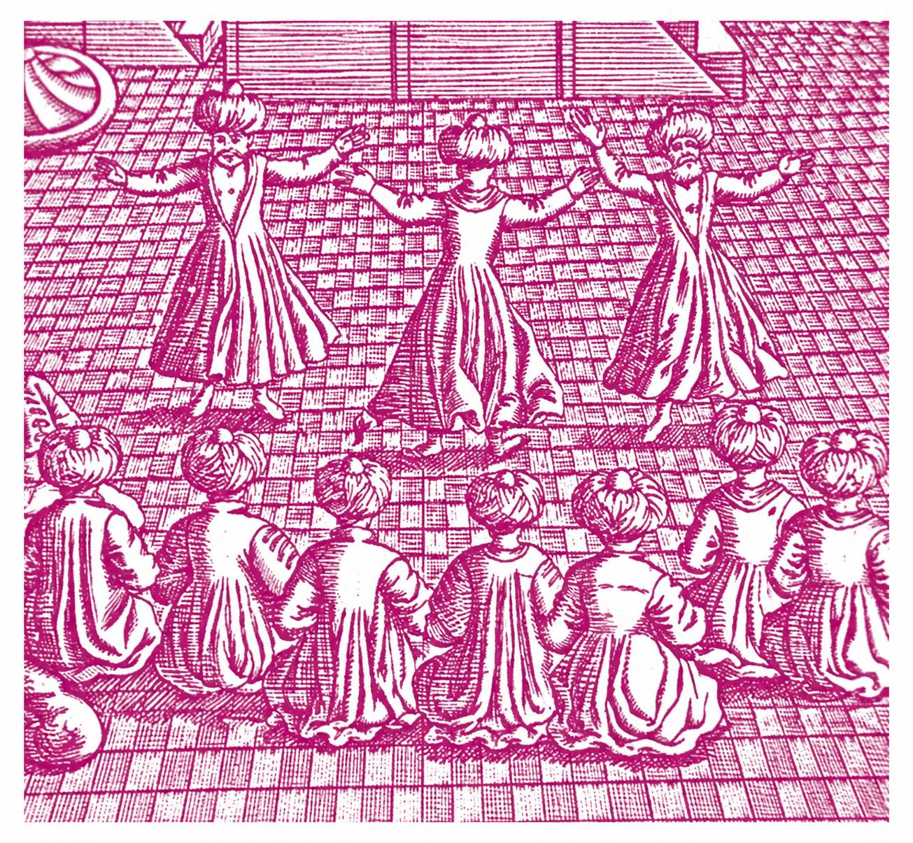

In general terms, my research critically examines various forms of religion — ancient, early modern and contemporary — in their historical, social, and cultural contexts. More specifically:

## Current Research 

Three particular research projects are occupying me at present:

- Benjamin Lay and early abolitionism
- Conceptualising contemporary Christadelphianism
- Apocalyptic belief and existential threat

## Main Research Areas

My main research interests can be roughly grouped under the following headings. They certainly do not cover everything, as I also publish on topics such as magic, anarchism, and pedagogy, but they cover most:

### Religion and Violence
In addition to initiating the MPhil pathway in Religion and Conflict in the Faculty of Divinity in 2020, I have an active research interest in a number of topics within the subject area, including the intersections between religion and terrorism, violence and peace in the origins of Christianity, and the role of violence in apocalyptic movements.

Here are a couple of examples of my work:

- ‘Putting the Apocalyptic Jesus to the Sword: Why were Jesus’ Disciples Armed?’ *Journal for the Study of the New Testament* 45.4 (2023), 371–404. DOI: [https://doi.org/10.1177/0142064X221150484](https://doi.org/10.1177/0142064X221150484)
- ‘The Problem of Apocalyptic Terrorism.’ *Journal of Religion and Violence* 8.1 (2020), 58-104.

### Slavery
I have a longstanding interest in slavery, and more specifically, the role of religion in both its justification and abolition. My research focuses particularly on early modern slave systems of the Atlantic and Mediterranean, both Christian and Muslim, and their intersections. I am especially interested in the roles played by radical Christian dissenters — as enslavers and enslaved, defenders of slavery and advocates of abolition.

I am currently working, with Marcus Rediker, on a critical edition Benjamin Lay's radical abolitionist book, _All Slaver-Keepers that Keep the Innocent in Bondage, Apostates_ (1737) and a book on the Germantown Protest of 1688, the earliest abolitionist text in the Anglophone Atlantic world.

### Christian Origins
One of my main areas of research is the study of Christian origins. I have published widely on the historical Jesus and the earliest Christian communities. I have a particular interest in examining the themes of poverty, health, madness, miracles, exorcisms, myth and ethics in earliest Christianity and their relationship to ancient popular culture, the neglected everyday world of antiquity.

Although I have written a number of articles in this field (see Publications), my two books in this area might be of interest:

- *Paul, Poverty and Survival,* Edinburgh: T&T Clark, 1998
- *Studies in the Historical Jesus: Anarchy, Miracles, and Madness,* Critical Studies in Religion and History 1, Cambridge: Mutual Academic, 2023. Pdf available here: [https://doi.org/10.17613/mpjp-3c10](https://doi.org/10.17613/mpjp-3c10)

### Early Modern Religious Radicalism and Islam
One of my major areas of interest is religious radicalism in the early modern Anglophone world, and, in particular, its perception of, and interaction with, Islam and Muslims. In addition to articles and chapters, I have published a book on the subject:

- _Early Quakers and Islam: Slavery, Apocalyptic and Christian-Muslim Encounters in the Seventeenth Century,_ Studies on Inter-Religious Relations 59, Uppsala: Swedish Science Press, 2013.

### Apocalypticism and Millenarian Movements
I also have an enduring interest in the social and historical consequences of beliefs concerning the imminent transformation of the world. This is most obvious in my current work as Project Lead of the [Centre for the Critical Study of Apocalyptic and Millenarian Movements](https://censamm.org/) and its associated, open-access resource, the [Critical Dictionary of Apocalyptic and Millenarian Movements](https://www.cdamm.org/).

